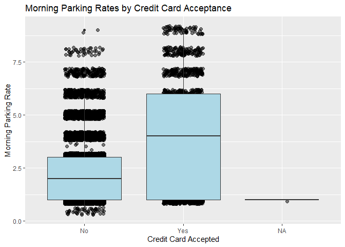
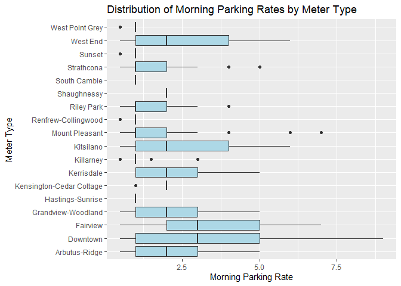
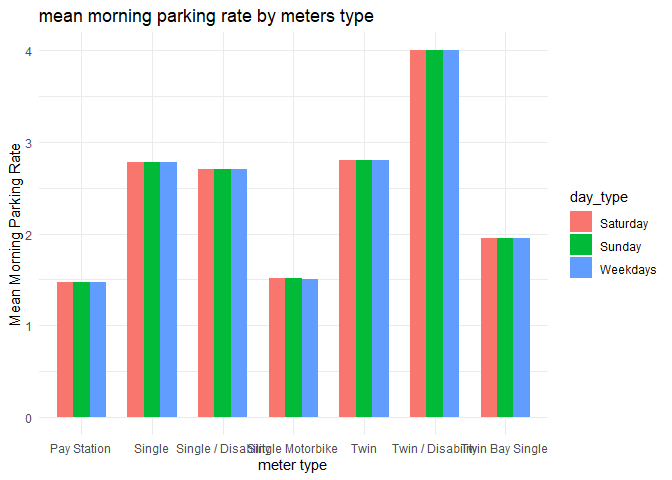
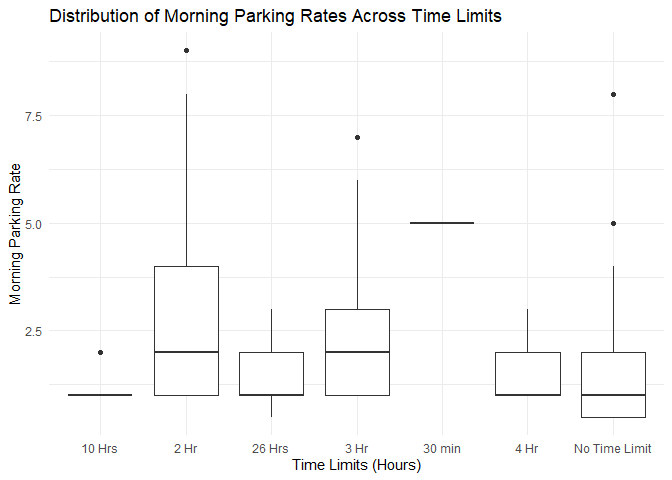

Mini Data Analysis Milestone 2
================

*To complete this milestone, you can either edit [this `.rmd`
file](https://raw.githubusercontent.com/UBC-STAT/stat545.stat.ubc.ca/master/content/mini-project/mini-project-2.Rmd)
directly. Fill in the sections that are commented out with
`<!--- start your work here--->`. When you are done, make sure to knit
to an `.md` file by changing the output in the YAML header to
`github_document`, before submitting a tagged release on canvas.*

# Welcome to the rest of your mini data analysis project!

In Milestone 1, you explored your data. and came up with research
questions. This time, we will finish up our mini data analysis and
obtain results for your data by:

- Making summary tables and graphs
- Manipulating special data types in R: factors and/or dates and times.
- Fitting a model object to your data, and extract a result.
- Reading and writing data as separate files.

We will also explore more in depth the concept of *tidy data.*

**NOTE**: The main purpose of the mini data analysis is to integrate
what you learn in class in an analysis. Although each milestone provides
a framework for you to conduct your analysis, it’s possible that you
might find the instructions too rigid for your data set. If this is the
case, you may deviate from the instructions – just make sure you’re
demonstrating a wide range of tools and techniques taught in this class.

# Instructions

**To complete this milestone**, edit [this very `.Rmd`
file](https://raw.githubusercontent.com/UBC-STAT/stat545.stat.ubc.ca/master/content/mini-project/mini-project-2.Rmd)
directly. Fill in the sections that are tagged with
`<!--- start your work here--->`.

**To submit this milestone**, make sure to knit this `.Rmd` file to an
`.md` file by changing the YAML output settings from
`output: html_document` to `output: github_document`. Commit and push
all of your work to your mini-analysis GitHub repository, and tag a
release on GitHub. Then, submit a link to your tagged release on canvas.

**Points**: This milestone is worth 50 points: 45 for your analysis, and
5 for overall reproducibility, cleanliness, and coherence of the Github
submission.

**Research Questions**: In Milestone 1, you chose two research questions
to focus on. Wherever realistic, your work in this milestone should
relate to these research questions whenever we ask for justification
behind your work. In the case that some tasks in this milestone don’t
align well with one of your research questions, feel free to discuss
your results in the context of a different research question.

# Learning Objectives

By the end of this milestone, you should:

- Understand what *tidy* data is, and how to create it using `tidyr`.
- Generate a reproducible and clear report using R Markdown.
- Manipulating special data types in R: factors and/or dates and times.
- Fitting a model object to your data, and extract a result.
- Reading and writing data as separate files.

# Setup

Begin by loading your data and the tidyverse package below:

``` r
library(datateachr) # <- might contain the data you picked!
library(tidyverse)
```

# Task 1: Process and summarize your data

From milestone 1, you should have an idea of the basic structure of your
dataset (e.g. number of rows and columns, class types, etc.). Here, we
will start investigating your data more in-depth using various data
manipulation functions.

### 1.1 (1 point)

First, write out the 4 research questions you defined in milestone 1
were. This will guide your work through milestone 2:

<!-------------------------- Start your work below ---------------------------->

1.  Is there any correlation between the acceptance of credit cards at
    parking meters and the average morning parking rates they charge?
2.  What is the distribution of morning parking rates (r_mf_9a_6p) for
    parking meters located in different geographic areas
    (geo_local_area)? Are there significant differences in pricing
    patterns across neighborhoods?
3.  Are there differences in morning parking rates (r_mf_9a_6p) between
    weekdays (Mon-Fri) and weekends (Sat-Sun) for different meter types
    (meter_head)?
4.  Do parking meters with longer time limits (t_mf_9a_6p) tend to have
    higher morning parking rates
    (r_mf_9a_6p)?<!----------------------------------------------------------------------------->

Here, we will investigate your data using various data manipulation and
graphing functions.

### 1.2 (8 points)

Now, for each of your four research questions, choose one task from
options 1-4 (summarizing), and one other task from 4-8 (graphing). You
should have 2 tasks done for each research question (8 total). Make sure
it makes sense to do them! (e.g. don’t use a numerical variables for a
task that needs a categorical variable.). Comment on why each task helps
(or doesn’t!) answer the corresponding research question.

Ensure that the output of each operation is printed!

Also make sure that you’re using dplyr and ggplot2 rather than base R.
Outside of this project, you may find that you prefer using base R
functions for certain tasks, and that’s just fine! But part of this
project is for you to practice the tools we learned in class, which is
dplyr and ggplot2.

**Summarizing:**

1.  Compute the *range*, *mean*, and *two other summary statistics* of
    **one numerical variable** across the groups of **one categorical
    variable** from your data.
2.  Compute the number of observations for at least one of your
    categorical variables. Do not use the function `table()`!
3.  Create a categorical variable with 3 or more groups from an existing
    numerical variable. You can use this new variable in the other
    tasks! *An example: age in years into “child, teen, adult, senior”.*
4.  Compute the proportion and counts in each category of one
    categorical variable across the groups of another categorical
    variable from your data. Do not use the function `table()`!

**Graphing:**

6.  Create a graph of your choosing, make one of the axes logarithmic,
    and format the axes labels so that they are “pretty” or easier to
    read.
7.  Make a graph where it makes sense to customize the alpha
    transparency.

Using variables and/or tables you made in one of the “Summarizing”
tasks:

8.  Create a graph that has at least two geom layers.
9.  Create 3 histograms, with each histogram having different sized
    bins. Pick the “best” one and explain why it is the best.

Make sure it’s clear what research question you are doing each operation
for!

<!------------------------- Start your work below ----------------------------->

1.  **Is there any correlation between the acceptance of credit cards at
    parking meters and the average morning parking rates they charge?**

    *summarizing*: Compute the mean and range of morning parking rates
    (**`r_mf_9a_6p`**) for parking meters that accept credit cards
    (**`credit_card`**).

    ``` r
    summary_stats <- parking_meters %>%
      filter(!is.na(r_mf_9a_6p) & !is.na(credit_card)) %>%
      mutate(morning_rate_numeric = as.numeric(gsub("\\$", "", r_mf_9a_6p))) %>%
      group_by(credit_card) %>%
      summarize(
        mean_morning_rate = mean(morning_rate_numeric),
        rate_range_min = min(morning_rate_numeric),
        rate_range_max = max(morning_rate_numeric),
        median_morning_rate = median(morning_rate_numeric),
        std_dev_morning_rate = sd(morning_rate_numeric)
      )
    print(summary_stats)
    ```

        ## # A tibble: 2 × 6
        ##   credit_card mean_morning_rate rate_range_min rate_range_max
        ##   <chr>                   <dbl>          <dbl>          <dbl>
        ## 1 No                       2.47            0.5              9
        ## 2 Yes                      3.96            1                9
        ## # ℹ 2 more variables: median_morning_rate <dbl>, std_dev_morning_rate <dbl>

    after run this code, i see the average morning parking rate for
    meters that accept credit cards is higher.

    *Graphing*:Create a scatter plot to see the relationship between
    morning parking rates (**`r_mf_9a_6p`**) and acceptance of credit
    cards (**`credit_card`**).

    ``` r
    ggplot(data = parking_meters, aes(x = credit_card, y = as.numeric(gsub("\\$", "", r_mf_9a_6p)))) +
      geom_jitter(width = 0.2, alpha = 0.5, size = 2) +
      labs(
        title = "Morning Parking Rates by Credit Card Acceptance",
        x = "Credit Card Accepted",
        y = "Morning Parking Rate"
      ) +
       geom_boxplot(fill = "lightblue") 
    ```

        ## Warning: Removed 20 rows containing non-finite values (`stat_boxplot()`).

        ## Warning: Removed 20 rows containing missing values (`geom_point()`).

    <!-- -->

    the boxplot and jitterplot helps explore the relationship between
    credit card acceptance and morning parking rate.

2.  **What is the distribution of morning parking rates (r_mf_9a_6p) for
    parking meters located in different geographic areas
    (geo_local_area)? Are there significant differences in pricing
    patterns across neighborhoods?**

    Summarizing: Compute the range, mean, and two other summary
    statistics of morning parking rates (r_mf_9a_6p) across the groups
    of geographic areas (geo_local_area).

    ``` r
    summary_stats <- parking_meters %>%
      group_by(geo_local_area) %>%
      summarise(
        Mean_Morning_Rate = mean(as.numeric(gsub("\\$", "", r_mf_9a_6p)), na.rm = TRUE),
        Rate_Range = max(as.numeric(gsub("\\$", "", r_mf_9a_6p)), na.rm = TRUE) -
                     min(as.numeric(gsub("\\$", "", r_mf_9a_6p)), na.rm = TRUE),
        Median_Morning_Rate = median(as.numeric(gsub("\\$", "", r_mf_9a_6p)), na.rm = TRUE),
        Std_Deviation = sd(as.numeric(gsub("\\$", "", r_mf_9a_6p)), na.rm = TRUE)
      )
    print(summary_stats)
    ```

        ## # A tibble: 18 × 5
        ##    geo_local_area Mean_Morning_Rate Rate_Range Median_Morning_Rate Std_Deviation
        ##    <chr>                      <dbl>      <dbl>               <dbl>         <dbl>
        ##  1 Arbutus-Ridge              2.25         4.5                   2        1.30  
        ##  2 Downtown                   3.33         8.5                   3        2.19  
        ##  3 Fairview                   3.22         6.5                   3        1.95  
        ##  4 Grandview-Woo…             2.08         4.5                   2        1.11  
        ##  5 Hastings-Sunr…             1            0                     1        0     
        ##  6 Kensington-Ce…             1.78         1                     2        0.418 
        ##  7 Kerrisdale                 2.46         4                     2        1.24  
        ##  8 Killarney                  1.31         2.5                   1        0.749 
        ##  9 Kitsilano                  2.33         5.5                   2        1.54  
        ## 10 Mount Pleasant             1.84         6.5                   1        1.46  
        ## 11 Renfrew-Colli…             0.988        0.5                   1        0.0762
        ## 12 Riley Park                 1.58         3.5                   1        0.942 
        ## 13 Shaughnessy                2            0                     2        0     
        ## 14 South Cambie               1            0                     1        0     
        ## 15 Strathcona                 1.90         4.5                   1        1.26  
        ## 16 Sunset                     0.993        0.5                   1        0.0585
        ## 17 West End                   2.75         5.5                   2        1.76  
        ## 18 West Point Gr…             0.997        0.5                   1        0.0376

    after run this code, i see that average morning rate at downtown and
    neighborhood tend to have a higher rating.

    graphing:

    ``` r
    ggplot(parking_meters,aes(geo_local_area,as.numeric(gsub("\\$","",r_mf_9a_6p))))+
      geom_boxplot(fill = "lightblue")+
      labs(title = "Distribution of Morning Parking Rates by Meter Type",
           x = "Meter Type",
           y = "Morning Parking Rate",
           fill = "Meter Type")+
      coord_flip() 
    ```

        ## Warning: Removed 20 rows containing non-finite values (`stat_boxplot()`).

    <!-- -->

after shown plot, i see there are significant difference in rating
pattern across different regions

3.  **Are there differences in morning parking rates between weekdays
    (Mon-Fri) and weekends (Sat-Sun) for different meter types
    (meter_head)?**

    summarizing:

    ``` r
    meter_type_counts <- parking_meters %>%
      group_by(meter_head) %>%
      summarize(count = n())


    meter_type_counts
    ```

        ## # A tibble: 7 × 2
        ##   meter_head          count
        ##   <chr>               <int>
        ## 1 Pay Station           326
        ## 2 Single                755
        ## 3 Single / Disability    82
        ## 4 Single Motorbike      152
        ## 5 Twin                 8614
        ## 6 Twin / Disability       8
        ## 7 Twin Bay Single        95

the code give me a summary of the number of parking meters for each type
of metters.

graphing:

``` r
filtered_data <- parking_meters %>%
  filter(!is.na(r_mf_9a_6p) & !is.na(r_sa_9a_6p) & !is.na(r_su_9a_6p))

reshaped_data <- filtered_data %>%
  select(meter_head, r_mf_9a_6p, r_sa_9a_6p, r_su_9a_6p) %>%
  pivot_longer(cols = c(r_mf_9a_6p, r_sa_9a_6p, r_su_9a_6p), names_to = "day_type", values_to = "morning_rate") %>%
  mutate(day_type = ifelse(day_type == "r_mf_9a_6p", "Weekdays", ifelse(day_type == "r_sa_9a_6p", "Saturday", "Sunday"))) %>%
  group_by(meter_head, day_type) %>%
  summarize(mean_morning_rate = mean(as.numeric(gsub("\\$", "", morning_rate)), na.rm = TRUE))
```

    ## `summarise()` has grouped output by 'meter_head'. You can override using the
    ## `.groups` argument.

``` r
ggplot(reshaped_data, aes(x = meter_head, y = mean_morning_rate, fill = day_type)) +
  geom_bar(stat = "identity", position = "dodge", width = 0.7) +
  labs(
    title = "mean morning parking rate by meters type",
    x = "meter type",
    y = "Mean Morning Parking Rate"
  ) +
  theme_minimal() 
```

<!-- -->

for each type of meters, we can see that the morning parking rates
between Saturday, Sunday and weekdays is nearly same.

4.  **Do parking meters with longer time limits (t_mf_9a_6p) tend to
    have higher morning parking rates (r_mf_9a_6p)?**

    summarzing:

    ``` r
    filtered_data <- parking_meters %>%
      filter(!is.na(t_mf_9a_6p) & !is.na(r_mf_9a_6p))


    filtered_data <- filtered_data %>%
      mutate(r_mf_9a_6p = as.numeric(gsub("\\$", "", r_mf_9a_6p)))


    summary_stats <- filtered_data %>%
      group_by(t_mf_9a_6p) %>%
      summarize(
        range = max(r_mf_9a_6p) - min(r_mf_9a_6p),
        mean = mean(r_mf_9a_6p),
        median = median(r_mf_9a_6p),
        sd = sd(r_mf_9a_6p)
      )

    print(summary_stats)
    ```

        ## # A tibble: 7 × 5
        ##   t_mf_9a_6p    range  mean median    sd
        ##   <chr>         <dbl> <dbl>  <dbl> <dbl>
        ## 1 10 Hrs          1    1.18      1 0.386
        ## 2 2 Hr            8    2.90      2 2.03 
        ## 3 26 Hrs          2.5  1.57      1 0.863
        ## 4 3 Hr            6    2.26      2 1.51 
        ## 5 30 min          0    5         5 0    
        ## 6 4 Hr            2    1.59      1 0.793
        ## 7 No Time Limit   7.5  1.47      1 1.15

we can see that the less time limit it allows, the more expensive of the
mean parking rates it charges.

graphing:

``` r
filtered_data <- parking_meters %>%
  filter(!is.na(t_mf_9a_6p) & !is.na(r_mf_9a_6p))


filtered_data <- filtered_data %>%
  mutate(r_mf_9a_6p = as.numeric(gsub("\\$", "", r_mf_9a_6p)))

filtered_data %>%
  ggplot(aes(x = t_mf_9a_6p, y = r_mf_9a_6p)) +
  geom_boxplot() +
  labs(
    title = "Distribution of Morning Parking Rates Across Time Limits",
    x = "Time Limits (Hours)",
    y = "Morning Parking Rate"
  ) +
  theme_minimal()
```

<!-- -->

from the plot we can see there is a trend that the time between time
limit and morning parking rates.

<!----------------------------------------------------------------------------->

### 1.3 (2 points)

Based on the operations that you’ve completed, how much closer are you
to answering your research questions? Think about what aspects of your
research questions remain unclear. Can your research questions be
refined, now that you’ve investigated your data a bit more? Which
research questions are yielding interesting results?

for the research question 1, I computed the mean and range of morning
parking rates for parking meters that accept credit cards and created a
scatter plot to visualize the relationship between morning parking rates
and credit card acceptance.

For the question 2, I also did a great job. I computed summary
statistics of morning parking rates across different geographic areas
(neighborhoods) and also created a box plot to visualize the
distribution of morning parking rates by geographic area.

For the question 3, the bar plot isnt help too much. Also I think I can
do further exploration for task 4 using a regression line to view the
trend, I notice that the time limit is categorical value.

# Task 2: Tidy your data

In this task, we will do several exercises to reshape our data. The goal
here is to understand how to do this reshaping with the `tidyr` package.

A reminder of the definition of *tidy* data:

- Each row is an **observation**
- Each column is a **variable**
- Each cell is a **value**

### 2.1 (2 points)

Based on the definition above, can you identify if your data is tidy or
untidy? Go through all your columns, or if you have \>8 variables, just
pick 8, and explain whether the data is untidy or tidy.

I think my data is tidy, becasue each row is a unique parking meter
which has unique parking meter types, the rate, the location, the unique
id. Also, each column represents a different attribute of the parking
meters such as rating in weekday between 9am to 6pm, rating in Sunday
between 9am to 6pm. Lastly, each cell in the dataset contains specific
the values related to the parking meters.

But I noticed that the data type for variable like r_mf_9am_6pm is
awkward, the data type is string, every time I need to convert this data
type to numeric value .

### 2.2 (4 points)

Now, if your data is tidy, untidy it! Then, tidy it back to it’s
original state.

If your data is untidy, then tidy it! Then, untidy it back to it’s
original state.

Be sure to explain your reasoning for this task. Show us the “before”
and “after”.

first look the dataset again:

``` r
glimpse(parking_meters)
```

    ## Rows: 10,032
    ## Columns: 22
    ## $ meter_head     <chr> "Twin", "Pay Station", "Twin", "Single", "Twin", "Twin"…
    ## $ r_mf_9a_6p     <chr> "$2.00", "$1.00", "$1.00", "$1.00", "$2.00", "$2.00", "…
    ## $ r_mf_6p_10     <chr> "$4.00", "$1.00", "$1.00", "$1.00", "$1.00", "$1.00", "…
    ## $ r_sa_9a_6p     <chr> "$2.00", "$1.00", "$1.00", "$1.00", "$2.00", "$2.00", "…
    ## $ r_sa_6p_10     <chr> "$4.00", "$1.00", "$1.00", "$1.00", "$1.00", "$1.00", "…
    ## $ r_su_9a_6p     <chr> "$2.00", "$1.00", "$1.00", "$1.00", "$2.00", "$2.00", "…
    ## $ r_su_6p_10     <chr> "$4.00", "$1.00", "$1.00", "$1.00", "$1.00", "$1.00", "…
    ## $ rate_misc      <chr> NA, "$ .50", NA, NA, NA, NA, NA, NA, NA, NA, NA, NA, NA…
    ## $ time_in_effect <chr> "METER IN EFFECT: 9:00 AM TO 10:00 PM", "METER IN EFFEC…
    ## $ t_mf_9a_6p     <chr> "2 Hr", "10 Hrs", "2 Hr", "2 Hr", "2 Hr", "3 Hr", "2 Hr…
    ## $ t_mf_6p_10     <chr> "4 Hr", "10 Hrs", "4 Hr", "4 Hr", "4 Hr", "4 Hr", "4 Hr…
    ## $ t_sa_9a_6p     <chr> "2 Hr", "10 Hrs", "2 Hr", "2 Hr", "2 Hr", "3 Hr", "2 Hr…
    ## $ t_sa_6p_10     <chr> "4 Hr", "10 Hrs", "4 Hr", "4 Hr", "4 Hr", "4 Hr", "4 Hr…
    ## $ t_su_9a_6p     <chr> "2 Hr", "10 Hrs", "2 Hr", "2 Hr", "2 Hr", "3 Hr", "2 Hr…
    ## $ t_su_6p_10     <chr> "4 Hr", "10 Hrs", "4 Hr", "4 Hr", "4 Hr", "4 Hr", "4 Hr…
    ## $ time_misc      <chr> NA, "No Time Limit", NA, NA, NA, NA, NA, NA, NA, NA, NA…
    ## $ credit_card    <chr> "No", "Yes", "No", "No", "No", "No", "No", "No", "No", …
    ## $ pay_phone      <chr> "66890", "59916", "57042", "57159", "51104", "60868", "…
    ## $ longitude      <dbl> -123.1289, -123.0982, -123.1013, -123.1862, -123.1278, …
    ## $ latitude       <dbl> 49.28690, 49.27215, 49.25468, 49.26341, 49.26354, 49.27…
    ## $ geo_local_area <chr> "West End", "Strathcona", "Riley Park", "West Point Gre…
    ## $ meter_id       <chr> "670805", "471405", "C80145", "D03704", "301023", "5913…

untidy data:

``` r
untidy_parking_meters <- parking_meters %>%
  select(meter_head, r_mf_9a_6p, r_mf_6p_10, r_sa_9a_6p, r_sa_6p_10, r_su_9a_6p, r_su_6p_10,geo_local_area) %>%
  pivot_longer(
    cols = c(r_mf_9a_6p, r_mf_6p_10, r_sa_9a_6p, r_sa_6p_10, r_su_9a_6p, r_su_6p_10),
    names_to = "time_period",
    values_to  ="parking_rating" 
  )

print(untidy_parking_meters)
```

    ## # A tibble: 60,192 × 4
    ##    meter_head  geo_local_area time_period parking_rating
    ##    <chr>       <chr>          <chr>       <chr>         
    ##  1 Twin        West End       r_mf_9a_6p  $2.00         
    ##  2 Twin        West End       r_mf_6p_10  $4.00         
    ##  3 Twin        West End       r_sa_9a_6p  $2.00         
    ##  4 Twin        West End       r_sa_6p_10  $4.00         
    ##  5 Twin        West End       r_su_9a_6p  $2.00         
    ##  6 Twin        West End       r_su_6p_10  $4.00         
    ##  7 Pay Station Strathcona     r_mf_9a_6p  $1.00         
    ##  8 Pay Station Strathcona     r_mf_6p_10  $1.00         
    ##  9 Pay Station Strathcona     r_sa_9a_6p  $1.00         
    ## 10 Pay Station Strathcona     r_sa_6p_10  $1.00         
    ## # ℹ 60,182 more rows

make it tidy again :

``` r
tidy_parking_meters <- untidy_parking_meters %>%
  pivot_wider(
    names_from = time_period,
    values_from = parking_rating
  )
```

    ## Warning: Values from `parking_rating` are not uniquely identified; output will contain
    ## list-cols.
    ## • Use `values_fn = list` to suppress this warning.
    ## • Use `values_fn = {summary_fun}` to summarise duplicates.
    ## • Use the following dplyr code to identify duplicates.
    ##   {data} %>%
    ##   dplyr::group_by(meter_head, geo_local_area, time_period) %>%
    ##   dplyr::summarise(n = dplyr::n(), .groups = "drop") %>%
    ##   dplyr::filter(n > 1L)

``` r
print(tidy_parking_meters)
```

    ## # A tibble: 80 × 8
    ##    meter_head         geo_local_area r_mf_9a_6p r_mf_6p_10 r_sa_9a_6p r_sa_6p_10
    ##    <chr>              <chr>          <list>     <list>     <list>     <list>    
    ##  1 Twin               West End       <chr>      <chr>      <chr>      <chr>     
    ##  2 Pay Station        Strathcona     <chr [61]> <chr [61]> <chr [61]> <chr [61]>
    ##  3 Twin               Riley Park     <chr>      <chr>      <chr>      <chr>     
    ##  4 Single             West Point Gr… <chr [8]>  <chr [8]>  <chr [8]>  <chr [8]> 
    ##  5 Twin               Fairview       <chr>      <chr>      <chr>      <chr>     
    ##  6 Twin               Downtown       <chr>      <chr>      <chr>      <chr>     
    ##  7 Single             Downtown       <chr>      <chr>      <chr>      <chr>     
    ##  8 Twin               South Cambie   <chr [76]> <chr [76]> <chr [76]> <chr [76]>
    ##  9 Pay Station        Riley Park     <chr [17]> <chr [17]> <chr [17]> <chr [17]>
    ## 10 Single / Disabili… Kitsilano      <chr [8]>  <chr [8]>  <chr [8]>  <chr [8]> 
    ## # ℹ 70 more rows
    ## # ℹ 2 more variables: r_su_9a_6p <list>, r_su_6p_10 <list>

### 2.3 (4 points)

Now, you should be more familiar with your data, and also have made
progress in answering your research questions. Based on your interest,
and your analyses, pick 2 of the 4 research questions to continue your
analysis in the remaining tasks:

<!-------------------------- Start your work below ---------------------------->

1.  **Do parking meters with longer time limits (t_mf_9a_6p) tend to
    have higher morning parking rates (r_mf_9a_6p)?**
2.  **Are there differences in morning parking rates between weekdays
    (Mon-Fri) and weekends (Sat-Sun) for different meter types
    (meter_head)?**

<!----------------------------------------------------------------------------->

Explain your decision for choosing the above two research questions.

for the first question, it would be great if we can find a prediction
model to see the relationship between the parking meter time limit and
parking rates instead of just using the boxplot. For the second
question, the bar plot cannot tell us the minor differences in morning
parking rates between the weekdays and weekend, we could plot another
graph.

Now, try to choose a version of your data that you think will be
appropriate to answer these 2 questions. Use between 4 and 8 functions
that we’ve covered so far (i.e. by filtering, cleaning, tidy’ing,
dropping irrelevant columns, etc.).

(If it makes more sense, then you can make/pick two versions of your
data, one for each research question.)

for the first research question, we want to focus on the relationship
between time limit Monday to Friday from 9am to 6pm, and morning parking
rates

``` r
filtered_parking_meters <- parking_meters %>%
  select(meter_head,meter_id, t_mf_9a_6p, r_mf_9a_6p) %>%
  filter(!is.na(t_mf_9a_6p) & !is.na(r_mf_9a_6p)) %>%
  mutate(
    time_limit_hours = as.numeric(gsub(" Hr", "", t_mf_9a_6p)),
    morning_rate_numeric = as.numeric(gsub("\\$", "", r_mf_9a_6p))
  ) %>%
  select(-t_mf_9a_6p, -r_mf_9a_6p)
```

    ## Warning: There was 1 warning in `mutate()`.
    ## ℹ In argument: `time_limit_hours = as.numeric(gsub(" Hr", "", t_mf_9a_6p))`.
    ## Caused by warning:
    ## ! 强制改变过程中产生了NA

``` r
print(filtered_parking_meters)
```

    ## # A tibble: 10,002 × 4
    ##    meter_head  meter_id time_limit_hours morning_rate_numeric
    ##    <chr>       <chr>               <dbl>                <dbl>
    ##  1 Twin        670805                  2                    2
    ##  2 Pay Station 471405                 NA                    1
    ##  3 Twin        C80145                  2                    1
    ##  4 Single      D03704                  2                    1
    ##  5 Twin        301023                  2                    2
    ##  6 Twin        591318                  3                    2
    ##  7 Twin        580933                  2                    2
    ##  8 Single      580935                  2                    2
    ##  9 Twin        B71501                  2                    4
    ## 10 Twin        591340                  3                    2
    ## # ℹ 9,992 more rows

this version change the data type to numeric type and only focus on the
relevant data.

for the second question, we want to focus on the data morning parking
rate for weekdays, the parking rate for Saturday, the parking rate for
Sunday, and the meter type.

``` r
filtered2_parking_meters<- parking_meters %>%
  select(meter_id, meter_head, r_mf_9a_6p, r_sa_9a_6p, r_su_9a_6p) %>%
  filter(!is.na(r_mf_9a_6p) & !is.na(r_sa_9a_6p) & !is.na(r_su_9a_6p)) %>%
  mutate(
    morning_rate_weekdays = as.numeric(gsub("\\$", "", r_mf_9a_6p)),
    morning_rate_saturdays = as.numeric(gsub("\\$", "", r_sa_9a_6p)),
    morning_rate_sundays = as.numeric(gsub("\\$", "", r_su_9a_6p))
  ) %>%
  select(-r_mf_9a_6p, -r_sa_9a_6p, -r_su_9a_6p)

print(filtered2_parking_meters)
```

    ## # A tibble: 10,009 × 5
    ##    meter_id meter_head  morning_rate_weekdays morning_rate_saturdays
    ##    <chr>    <chr>                       <dbl>                  <dbl>
    ##  1 670805   Twin                            2                      2
    ##  2 471405   Pay Station                     1                      1
    ##  3 C80145   Twin                            1                      1
    ##  4 D03704   Single                          1                      1
    ##  5 301023   Twin                            2                      2
    ##  6 591318   Twin                            2                      2
    ##  7 580933   Twin                            2                      2
    ##  8 580935   Single                          2                      2
    ##  9 B71501   Twin                            4                      4
    ## 10 591340   Twin                            2                      2
    ## # ℹ 9,999 more rows
    ## # ℹ 1 more variable: morning_rate_sundays <dbl>

# Task 3: Modelling

## 3.0 (no points)

Pick a research question from 1.2, and pick a variable of interest
(we’ll call it “Y”) that’s relevant to the research question. Indicate
these.

<!-------------------------- Start your work below ---------------------------->

**Research Question**: **parking meters with longer time limits
(t_mf_9a_6p) tend to have higher morning parking rates (r_mf_9a_6p)**

**Variable of interest**: morning parking rates for Monday to Friday

<!----------------------------------------------------------------------------->

## 3.1 (3 points)

Fit a model or run a hypothesis test that provides insight on this
variable with respect to the research question. Store the model object
as a variable, and print its output to screen. We’ll omit having to
justify your choice, because we don’t expect you to know about model
specifics in STAT 545.

- **Note**: It’s OK if you don’t know how these models/tests work. Here
  are some examples of things you can do here, but the sky’s the limit.

  - You could fit a model that makes predictions on Y using another
    variable, by using the `lm()` function.
  - You could test whether the mean of Y equals 0 using `t.test()`, or
    maybe the mean across two groups are different using `t.test()`, or
    maybe the mean across multiple groups are different using `anova()`
    (you may have to pivot your data for the latter two).
  - You could use `lm()` to test for significance of regression
    coefficients.

``` r
# Fit a linear regression model
model <- lm(morning_rate_numeric ~ time_limit_hours, data = filtered_parking_meters)

# Print the model summary
print(model)
```

    ## 
    ## Call:
    ## lm(formula = morning_rate_numeric ~ time_limit_hours, data = filtered_parking_meters)
    ## 
    ## Coefficients:
    ##      (Intercept)  time_limit_hours  
    ##           4.1721           -0.6372

## 3.2 (3 points)

Produce something relevant from your fitted model: either predictions on
Y, or a single value like a regression coefficient or a p-value.

- Be sure to indicate in writing what you chose to produce.
- Your code should either output a tibble (in which case you should
  indicate the column that contains the thing you’re looking for), or
  the thing you’re looking for itself.
- Obtain your results using the `broom` package if possible. If your
  model is not compatible with the broom function you’re needing, then
  you can obtain your results by some other means, but first indicate
  which broom function is not compatible.

``` r
library(broom)
tidy(model)
```

    ## # A tibble: 2 × 5
    ##   term             estimate std.error statistic  p.value
    ##   <chr>               <dbl>     <dbl>     <dbl>    <dbl>
    ## 1 (Intercept)         4.17     0.104       40.3 0       
    ## 2 time_limit_hours   -0.637    0.0461     -13.8 3.87e-43

``` r
## also i want to make pridction 
augment(model, newdata = tibble(time_limit_hours = 1:5))
```

    ## # A tibble: 5 × 2
    ##   time_limit_hours .fitted
    ##              <int>   <dbl>
    ## 1                1   3.53 
    ## 2                2   2.90 
    ## 3                3   2.26 
    ## 4                4   1.62 
    ## 5                5   0.986

# Task 4: Reading and writing data

Get set up for this exercise by making a folder called `output` in the
top level of your project folder / repository. You’ll be saving things
there.

## 4.1 (3 points)

Take a summary table that you made from Task 1, and write it as a csv
file in your `output` folder. Use the `here::here()` function.

- **Robustness criteria**: You should be able to move your Mini Project
  repository / project folder to some other location on your computer,
  or move this very Rmd file to another location within your project
  repository / folder, and your code should still work.
- **Reproducibility criteria**: You should be able to delete the csv
  file, and remake it simply by knitting this Rmd file.

``` r
# install.packages("here")
library(here)
```

    ## here() starts at C:/Users/gexin/stat545/mda-justinwang-ubc

``` r
here()
```

    ## [1] "C:/Users/gexin/stat545/mda-justinwang-ubc"

``` r
path <- here("output","summaryTable.csv")
print(path)
```

    ## [1] "C:/Users/gexin/stat545/mda-justinwang-ubc/output/summaryTable.csv"

## 4.2 (3 points)

Write your model object from Task 3 to an R binary file (an RDS), and
load it again. Be sure to save the binary file in your `output` folder.
Use the functions `saveRDS()` and `readRDS()`.

- The same robustness and reproducibility criteria as in 4.1 apply here.

``` r
saveRDS(model,file= here("output","my_model.rds"))
my_model <- readRDS(here("output","my_model.rds"))
my_model
```

    ## 
    ## Call:
    ## lm(formula = morning_rate_numeric ~ time_limit_hours, data = filtered_parking_meters)
    ## 
    ## Coefficients:
    ##      (Intercept)  time_limit_hours  
    ##           4.1721           -0.6372

# Overall Reproducibility/Cleanliness/Coherence Checklist

Here are the criteria we’re looking for.

## Coherence (0.5 points)

The document should read sensibly from top to bottom, with no major
continuity errors.

The README file should still satisfy the criteria from the last
milestone, i.e. it has been updated to match the changes to the
repository made in this milestone.

## File and folder structure (1 points)

You should have at least three folders in the top level of your
repository: one for each milestone, and one output folder. If there are
any other folders, these are explained in the main README.

Each milestone document is contained in its respective folder, and
nowhere else.

Every level-1 folder (that is, the ones stored in the top level, like
“Milestone1” and “output”) has a `README` file, explaining in a sentence
or two what is in the folder, in plain language (it’s enough to say
something like “This folder contains the source for Milestone 1”).

## Output (1 point)

All output is recent and relevant:

- All Rmd files have been `knit`ted to their output md files.
- All knitted md files are viewable without errors on Github. Examples
  of errors: Missing plots, “Sorry about that, but we can’t show files
  that are this big right now” messages, error messages from broken R
  code
- All of these output files are up-to-date – that is, they haven’t
  fallen behind after the source (Rmd) files have been updated.
- There should be no relic output files. For example, if you were
  knitting an Rmd to html, but then changed the output to be only a
  markdown file, then the html file is a relic and should be deleted.

Our recommendation: delete all output files, and re-knit each
milestone’s Rmd file, so that everything is up to date and relevant.

## Tagged release (0.5 point)

You’ve tagged a release for Milestone 2.

### Attribution

Thanks to Victor Yuan for mostly putting this together.
